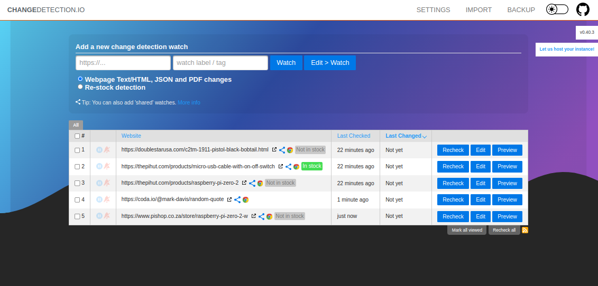

<!--
To README zostało automatycznie wygenerowane przez <https://github.com/YunoHost/apps/tree/master/tools/readme_generator>
Nie powinno być ono edytowane ręcznie.
-->

# changedetection dla YunoHost

[](https://ci-apps.yunohost.org/ci/apps/changedetection/)


[](https://install-app.yunohost.org/?app=changedetection)

*[Przeczytaj plik README w innym języku.](./ALL_README.md)*

> *Ta aplikacja pozwala na szybką i prostą instalację changedetection na serwerze YunoHost.*  
> *Jeżeli nie masz YunoHost zapoznaj się z [poradnikiem](https://yunohost.org/install) instalacji.*

## Przegląd

Detect website content changes and perform meaningful actions - trigger notifications via Discord, Email, Slack, Telegram, API calls and many more.

### Features

- Monitor web pages for changes - (such as watching prices, restock notification), to deep inspection such as PDF text support,
- JSON and XML monitoring and extensive text triggers.
- Get notifications when a website updates.


**Dostarczona wersja:** 0.49.3~ynh1

## Zrzuty ekranu



## Dokumentacja i zasoby

- Repozytorium z kodem źródłowym: <https://github.com/dgtlmoon/changedetection.io>
- Sklep YunoHost: <https://apps.yunohost.org/app/changedetection>
- Zgłaszanie błędów: <https://github.com/YunoHost-Apps/changedetection_ynh/issues>

## Informacje od twórców

Wyślij swój pull request do [gałęzi `testing`](https://github.com/YunoHost-Apps/changedetection_ynh/tree/testing).

Aby wypróbować gałąź `testing` postępuj zgodnie z instrukcjami:

```bash
sudo yunohost app install https://github.com/YunoHost-Apps/changedetection_ynh/tree/testing --debug
lub
sudo yunohost app upgrade changedetection -u https://github.com/YunoHost-Apps/changedetection_ynh/tree/testing --debug
```

**Więcej informacji o tworzeniu paczek aplikacji:** <https://yunohost.org/packaging_apps>
